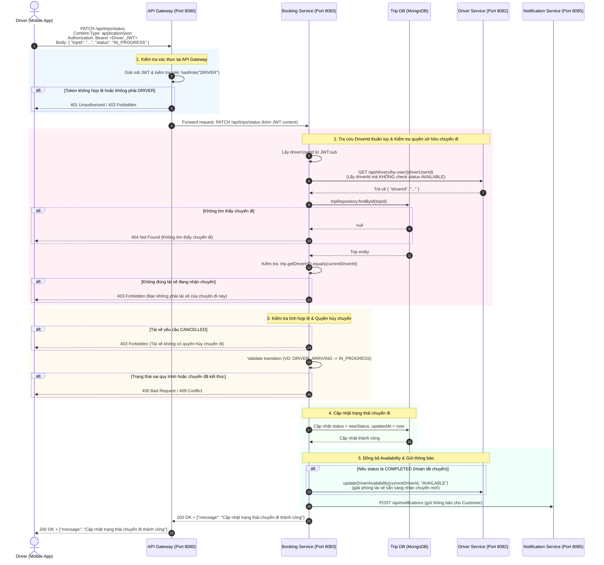

# Booking Service

`bookingservice` lưu dữ liệu đặt chuyến, nhà hàng, món ăn và offer ghép tài xế. Service này dùng MongoDB và yêu cầu JWT hợp lệ từ `userservice`.

## Cấu hình chính

- Port mặc định: `8083`, có thể đổi bằng `BOOKING_SERVICE_PORT`.
- Database: MongoDB `driverapp_booking_db`.
- JWT issuer/JWKS: mặc định `http://localhost:8081`.

## Endpoint hiện có

### 1. Driver Cập Nhật Trạng Thái Chuyến Đi (`PATCH /api/trips/status`)

Cho phép tài xế (`ROLE_DRIVER`) cập nhật tiến độ chuyến đi theo vòng đời chuyến đi.

- **HTTP Method**: `PATCH`
- **Endpoint**: `/api/trips/status`
- **Xác thực**: Bearer JWT Token (`ROLE_DRIVER`)
- **Headers**:
  ```http
  Authorization: Bearer <Driver_JWT>
  Content-Type: application/json
  Accept: application/json
  ```

#### Sơ đồ tuần tự (Sequence Diagram)



#### Request Body (JSON)
```json
{
  "tripId": "651f8a7e2b3c4d5e6f7a8b9c",
  "status": "IN_PROGRESS"
}
```

| Trường | Kiểu dữ liệu | Bắt buộc | Mô tả |
| :--- | :--- | :--- | :--- |
| `tripId` | `String` | Có | ID chuyến đi trên MongoDB |
| `status` | `TripStatus` | Có | Trạng thái mới: `DRIVER_ARRIVING`, `IN_PROGRESS`, `COMPLETED` |

#### Quy tắc nghiệp vụ (Business Rules)
1. **Kiểm tra quyền sở hữu (Driver Ownership Check)**: Lấy `driverId` qua `driverServiceClient.getDriverIdByUserId(driverUserId)` (gọi endpoint `GET /api/drivers/by-user/{userId}` bên Driver Service mà không bắt buộc trạng thái `AVAILABLE`). Nếu chuyến đi không thuộc về tài xế đang thực hiện (`trip.driverId != currentDriverId`), hệ thống trả về lỗi **`403 Forbidden`**.
2. **Chặn quyền hủy chuyến của tài xế**: Tài xế **không được phép** gửi trạng thái `CANCELLED`. Nếu gửi `status = "CANCELLED"`, hệ thống trả về lỗi **`403 Forbidden`** (*"Tài xế không có quyền hủy chuyến đi"*).
3. **Quy trình chuyển trạng thái một chiều hợp lệ**:
   - `DRIVER_ASSIGNED` ➔ `DRIVER_ARRIVING` (Tài xế đang đến điểm đón).
   - `DRIVER_ARRIVING` ➔ `IN_PROGRESS` (Đã đón khách / Bắt đầu hành trình).
   - `IN_PROGRESS` ➔ `COMPLETED` (Đã tới điểm đến / Hoàn tất chuyến đi).
   - Nếu chuyển đổi không theo đúng thứ tự, hệ thống trả về lỗi **`400 Bad Request`**.
4. **Kiểm tra chuyến đã kết thúc**: Nếu chuyến đi đã ở trạng thái `COMPLETED` hoặc `CANCELLED`, trả về lỗi **`409 Conflict`**.
5. **Đồng bộ Availability**: Khi trạng thái chuyển sang `COMPLETED`, hệ thống tự động gọi sang Driver Service (`driverServiceClient.updateDriverAvailability(driverId, "AVAILABLE")`) để giải phóng tài xế, cho phép tài xế nhận các chuyến đi mới.
6. **Bắn thông báo thời gian thực**: Gửi thông báo đến Notification Service (`notificationClient.createNotification`) cho khách hàng tương ứng với mỗi mốc trạng thái mới.

#### Response Body (`200 OK`)
```json
{
  "message": "Cập nhật trạng thái chuyến đi thành công"
}
```

#### Bảng mã lỗi phản hồi
| Mã lỗi | Nguyên nhân |
| :--- | :--- |
| `400 Bad Request` | `tripId` hoặc `status` trống/không hợp lệ; hoặc chuyển sai luồng trạng thái |
| `401 Unauthorized` | Token JWT không hợp lệ hoặc đã hết hạn |
| `403 Forbidden` | Tài xế không phải người nhận chuyến đi này, hoặc tài xế cố tình gửi trạng thái `CANCELLED` |
| `404 Not Found` | Không tìm thấy chuyến đi với `tripId` tương ứng hoặc không tìm thấy hồ sơ tài xế |
| `409 Conflict` | Chuyến đi đã kết thúc (`COMPLETED` hoặc `CANCELLED`) |
| `500 Internal Server Error` | Lỗi cập nhật cơ sở dữ liệu MongoDB |

---

### 2. Tạo Chuyến Đi (`POST /api/trips`)

Khách hàng (`ROLE_CUSTOMER`) tạo yêu cầu đặt chuyến (chở người, giao hàng, đặt món).

- **HTTP Method**: `POST`
- **Endpoint**: `/api/trips`
- **Xác thực**: Bearer JWT Token (`ROLE_CUSTOMER`)
- **Request Body**:
  ```json
  {
    "pickUpLatitude": 10.762622,
    "pickUpLongitude": 106.660172,
    "pickUpAddress": "123 Lê Lợi, Quận 1",
    "destinationLatitude": 10.776889,
    "destinationLongitude": 106.700806,
    "destinationAddress": "456 Nguyễn Thị Minh Khai, Quận 3",
    "shippingType": "PASSENGER",
    "vehicleType": "MOTORBIKE",
    "shippFare": 35000.0
  }
  ```
- **Response (`201 Created`)**:
  ```json
  {
    "tripId": "651f8a7e2b3c4d5e6f7a8b9c",
    "message": "Tạo chuyến thành công"
  }
  ```

---

### 3. Tài Xế Nhận Chuyến (`POST /api/trips/{tripId}/accept`)

Tài xế (`ROLE_DRIVER`) chấp nhận thực hiện một chuyến đi đang tìm tài xế.

- **HTTP Method**: `POST`
- **Endpoint**: `/api/trips/{tripId}/accept`
- **Xác thực**: Bearer JWT Token (`ROLE_DRIVER`)
- **Cơ chế**:
  - Kiểm tra tài xế đang `AVAILABLE` qua `driverServiceClient.getAvailableDriverId(driverUserId)`.
  - Atomic update chuyến đi từ trạng thái `SEARCHING_DRIVER` sang `DRIVER_ASSIGNED`.
  - Đổi trạng thái tài xế sang `ON_TRIP`.
- **Response (`200 OK`)**:
  ```json
  {
    "tripId": "651f8a7e2b3c4d5e6f7a8b9c",
    "status": "DRIVER_ASSIGNED",
    "message": "Nhận chuyến thành công"
  }
  ```

---

## Giải thích file

- `pom.xml`: khai báo Spring WebMVC, Spring Data MongoDB, Security, OAuth2 Resource Server, Validation, Lombok và test dependency.
- `mvnw`, `mvnw.cmd`, `.mvn/wrapper/maven-wrapper.properties`: Maven Wrapper.
- `.gitignore`, `.gitattributes`: cấu hình Git.
- `HELP.md`: file hướng dẫn mặc định của Spring Initializr.
- `src/main/java/com/driverapp/bookingservice/BookingserviceApplication.java`: class main khởi động service.
- `client/DriverServiceClient.java`: RestClient giao tiếp với Driver Service để kiểm tra tài xế khả dụng (`getAvailableDriverId`), lấy driverId theo userId (`getDriverIdByUserId`) và cập nhật availability (`updateDriverAvailability`, `setDriverOnTrip`).
- `client/NotificationClient.java`: RestClient gửi thông báo thời gian thực sang Notification Service.
- `config/SecurityConfig.java`: tắt CSRF, dùng session stateless và yêu cầu JWT cho mọi request.
- `controller/TripController.java`: các endpoint liên quan đến chuyến đi (`POST /api/trips`, `POST /api/trips/{tripId}/accept`, `PATCH /api/trips/status`).
- `controller/FoodController.java`: các endpoint CRUD món ăn.
- `controller/RestaurantController.java`: các endpoint quản lý nhà hàng.
- `controller/BusinessRegistrationController.java`: endpoint đăng ký đối tác kinh doanh.
- `dto/request/UpdateTripStatusRequest.java`: DTO nhận `tripId` và `status` cho API cập nhật trạng thái chuyến.
- `dto/request/CreateTripRequest.java`: DTO tạo chuyến đi mới.
- `models/Trip.java`: Mongo document `trips`, lưu tọa độ/điểm đón, điểm đến, loại giao hàng, loại xe, customer, driver, food, phí giao hàng và trạng thái chuyến.
- `models/Restaurant.java`: Mongo document `restaurants`, lưu tên nhà hàng, địa chỉ và tọa độ.
- `models/Food.java`: Mongo document `foods`, lưu tên món, danh sách option và restaurant id.
- `models/FoodOption.java`: object lồng trong `Food`, lưu kích cỡ và giá.
- `models/MatchingOffer.java`: Mongo document `matching_offers`, lưu offer gửi cho tài xế theo trip và trạng thái offer.
- `models/enums/ShippingType.java`: enum `PASSENGER`, `PARCEL_DELIVERY`, `FOOD_DELIVERY`.
- `models/enums/VehicleType.java`: enum `MOTORBIKE`, `CAR`.
- `models/enums/TripStatus.java`: enum vòng đời chuyến: `SEARCHING_DRIVER`, `DRIVER_ASSIGNED`, `DRIVER_ARRIVING`, `IN_PROGRESS`, `COMPLETED`, `CANCELLED`, `NO_DRIVER_FOUND`.
- `models/enums/MatchingOfferStatus.java`: enum `ACCEPTED`, `REJECTED`, `EXPIRED`, `CANCELLED`.
- `repository/TripRepository.java`: Mongo repository cho `Trip`.
- `repository/RestaurantRepository.java`: Mongo repository cho `Restaurant`.
- `repository/FoodRepository.java`: Mongo repository cho `Food`.
- `repository/MatchingOfferRepository.java`: Mongo repository cho `MatchingOffer`.
- `service/TripService.java` & `service/impl/TripServiceImpl.java`: Logic tạo chuyến, nhận chuyến, validate trạng thái, kiểm tra quyền tài xế và hoàn thành chuyến đi.
- `src/main/resources/application.yaml`: cấu hình port, MongoDB URI, UUID representation và JWT resource server.
- `src/test/java/com/driverapp/bookingservice/BookingserviceApplicationTests.java`: test khởi tạo context mặc định.
- `target/`: thư mục build sinh ra bởi Maven.

## Cách chạy

```powershell
.\mvnw.cmd spring-boot:run
```
